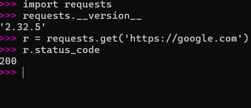
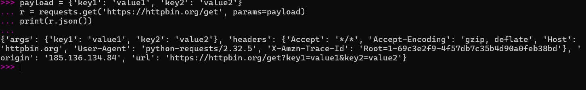
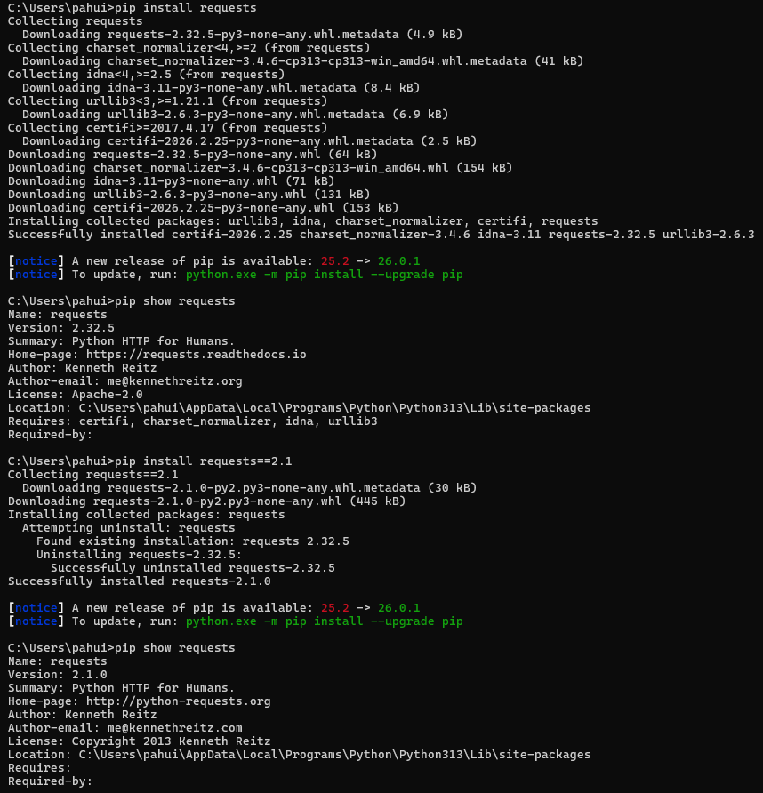
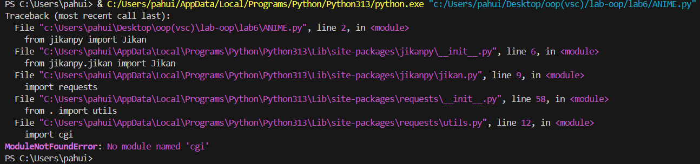
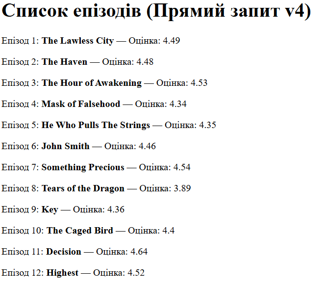
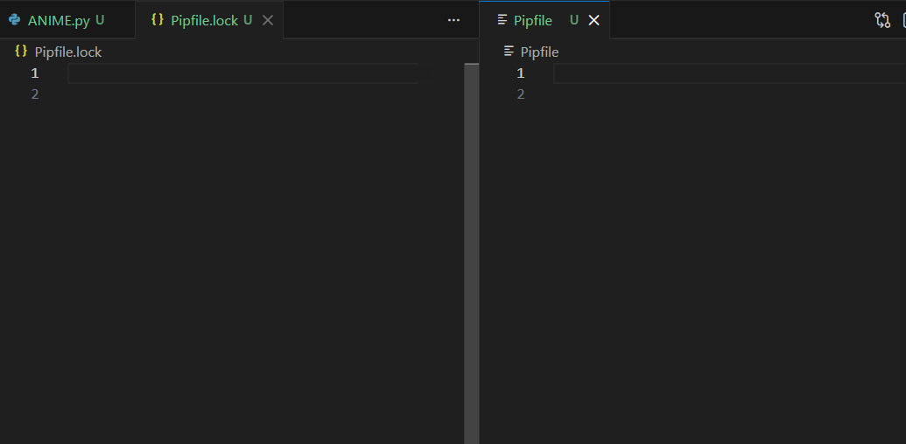
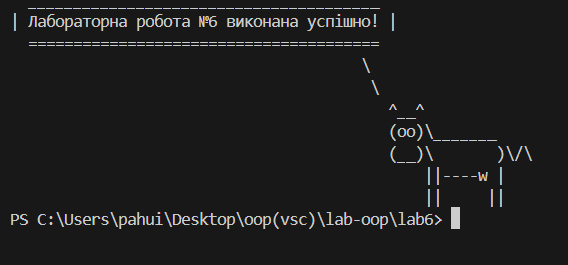
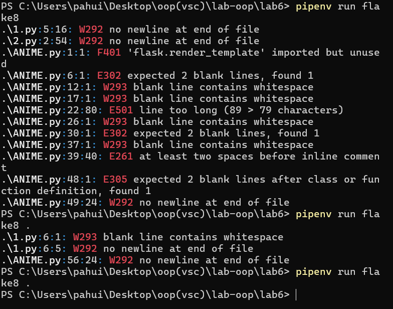

# Звіт до роботи
## Тема: Віртуальні середовища
### Мета роботи: Навчитися працювати з стороніми бібліотеками

---
### Виконання роботи
1. Перевірте які бібліотеки вже інстальовані на Вашому компютері та вкажіть їх у звіті
   
2. Вставте у звіт результат виконання команд
    
3. Ознайомтесь які ще методи є в бібліотеці requests, та спробуйте їх використати;

4. резльтат виконання команд 
 ```pip show requests
pip install requests==2.1
pip show requests
pip uninstall requests
 ```
 
5. вставити запропонований код та перевірити результат

6. вивести рейтинг серій аніме
   
7. які команди можна використовувати в pipenv
   Робота із середовищем
pipenv install — Створює віртуальне середовище та встановлює залежності з Pipfile.

pipenv shell — Активує віртуальне середовище у поточному терміналі.

pipenv --rm — Видаляє віртуальне середовище проєкту.

exit — Вихід із активованого середовища.

Керування пакетами
pipenv install <назва> — Встановлює пакет та додає його до Pipfile.

pipenv uninstall <назва> — Видаляє пакет.

pipenv update — Оновлює всі пакети та оновлює Pipfile.lock.

pipenv install --dev <назва> — Встановлює пакет лише для розробки.

Аналіз та безпека
pipenv graph — Показує дерево залежностей (яка бібліотека що використовує).

pipenv lock — Створює файл Pipfile.lock з точними версіями.

pipenv check — Перевіряє встановлені пакети на вразливості.

pipenv --venv — Показує шлях до папки віртуального середовища.
8. Переконайтесь що у Вас створились файли Pipfile та Pipfile.lock. Що в них знаходиться?

9. Змініть інтерпретатор Python із Вашого середовища та виконайте скрипт через кнопку

10. Вкажіть у звіті результат виконання flake8 та які помилки він знайшов у Вашому коді. Виправте ці помилки та запустіть flake8 знову, щоб переконатись що всі помилки виправлені.

11. Вкажіть у звіті результат виконання команд та які вразливості були знайдені у Вашому проєкті.
Команда pipenv check --scan: Перевірка вимог PEP 508 пройшла успішно (Passed!). Глибоке сканування через Safety підтвердило роботу інструменту, хоча для повної хмарної перевірки потрібен платний ключ.

Команда pipenv audit: Інструмент pip-audit був успішно встановлений і провів сканування.

Виявлена вразливість:

Пакет: pygments версії 2.19.2.

ID вразливості: CVE-2026-4539.

Аналіз: Це критично важливий момент для звіту. Виявлення вразливості показує, що навіть популярні бібліотеки можуть мати дефекти безпеки, які потрібно вчасно виправляти.

---
